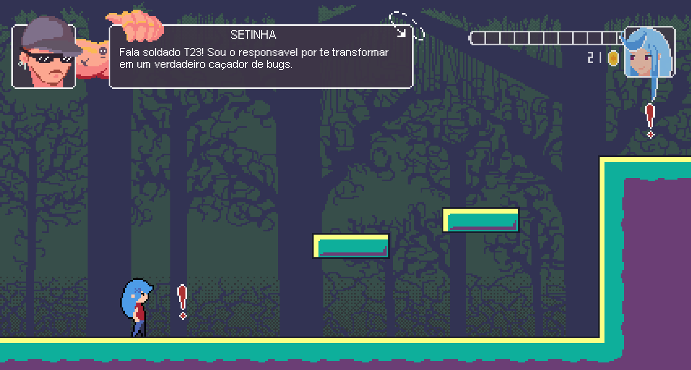
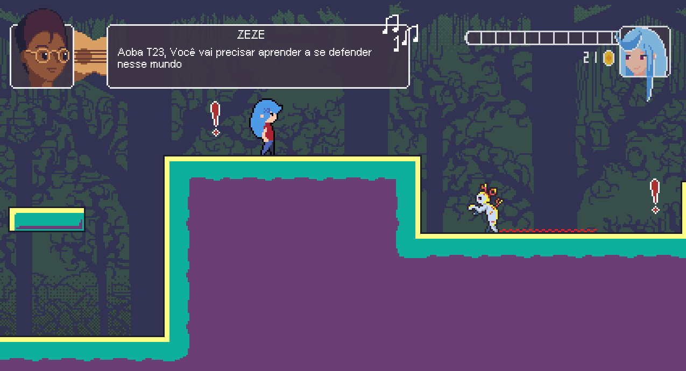

<h1 align="center">EBYTRGame</h1>

<h4>Projeto fazendo o jogo baseado na minha vivência no curso de full stack da <a href="https://www.betrybe.com">Trybe</a>, colocando em pratica todo o conhecimento que adquiri nessa jornada</h4>

Atenção o curso não é sobre criação de jogos, estou apenas aplicando conhecimentos! 😉

<h2>Sobre o projeto</h2>

1. Projeto feito no [Gamemaker.](https://gamemaker.io/en)
  - Para criar o executável basta abrir o projeto e gerar o executável a partir de uma licença no software
  - Iniciar um executável ja criado, basta abrir o arquivo EBYTR.exe (em ambientes windows)

2. Sprites feitas e animadas no [Aseprite.](https://www.aseprite.org) 
  - Sprites dispostas na pasta "sprites" em formatos .png (sprites sheets) e .ase (arquivo bruto)
  - arquivos de extenção .ase devem ser abertas por, de preferencia, aseprite ou arquivos que comportem o mesmo

<h2>Work In Progress</h2>

 - Algumas imagens de como está o progresso do game
 - 😁
 - 🎮
 - 🕹
 

  

  

